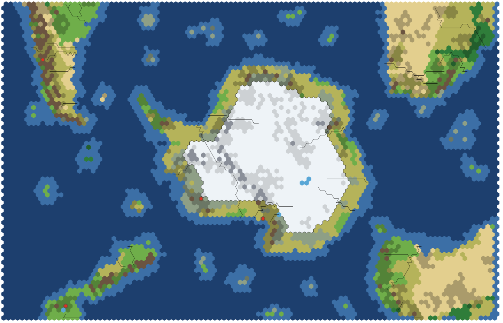

# Antarctica — a map mod for Civilization VII

A south polar map with Antarctica in the middle. Every civilization starts on the frozen continent,
on its ice-free coast; the Distant Lands lie across the Southern Ocean.

Current mod version: **1**.



Installing, game versions, version control and releasing are shared by every mod in this
repository and described in the [main README](../README.md). Commands below are run from the
repository root.

---

## The map

Three grids: **108x80** (8 players by default, up to 10), **124x92** (10, up to 12) and
**138x102** (12, up to 14). They offer the same map; only the scale changes.

**Antarctica** sits in the middle in a true polar projection, Greenwich up and 90°E to the right,
as on any map of the continent: the Peninsula points at South America across the Drake Passage,
the Weddell Sea is upper left, the Ross Sea at the bottom, East Antarctica to the right. The Ross,
Ronne and Filchner ice shelves count as land, so the coast follows their fronts.

- **The band.** Every land hex within **4 hexes of the sea** is open ground: tundra, plains and
  grassland, milder on the shore and on the Peninsula, with hills and the odd peak. It never gets
  snow. Around 600 hexes on the smallest grid, 800 on the largest.
- **The ice.** Further in, the continent is tundra under permanent snow, heavier the deeper you go,
  with no forests or marshes. It is ordinary land — you can walk and settle there, it is just poor.
- **Mountains.** The Transantarctic Mountains from Cape Adare across the pole to Coats Land, the
  Ellsworth Mountains, the Peninsula's spine, the Queen Maud Land and Prince Charles ranges; hills
  over the buried Gamburtsev Mountains and in Marie Byrd Land. Mount Erebus and Mount Sidley are
  volcanoes.
- **Rivers and lakes.** The Onyx, Antarctica's one real surface river, runs inland into Lake Vanda
  in the Dry Valleys. The others follow what radar has found under the ice: the Lambert Glacier into
  Prydz Bay and the 460 km river under the Institute Ice Stream into the Weddell Sea (both
  navigable at the mouth), Recovery Glacier, the Adventure Trench flood through the Byrd Glacier, the
  Siple Coast lakes under the Whillans Ice Stream, and the old river valleys under the Totten and
  Denman glaciers and Pine Island Bay. Lake Vostok is a three-hex lake deep in the ice.
- **Sea ice** floats in the Southern Ocean, never next to a coast, so every shore can be reached.

**The Distant Lands**, each in its own projection with its north pointing away from the pole, run
off the map edges:

| Corner | Land | Notes |
|---|---|---|
| upper left | South America, Cape Horn to the Paraná | Andes, Patagonian steppe, Pampas, Atacama; Paraná–Río de la Plata (navigable), Uruguay, Negro, Colorado, Chubut, Santa Cruz, Biobío; Villarrica; the Falklands; Torres del Paine and Iguazú Falls at their sites when the terrain allows |
| upper right | Southern Africa, the Cape to the Zambezi | Namib and Kalahari, Karoo, Highveld, Drakensberg; Zambezi (navigable), Orange and Vaal, Limpopo; Table Mountain (Hoerikwaggo) at the Cape |
| lower right | Australia, upside down with Tasmania towards the pole | the Outback, Great Dividing Range; Murray (navigable) and Darling, Burdekin, Fitzroy; Uluru and the Great Barrier Reef at their sites when the terrain allows |
| lower left | New Zealand, drawn about twice as large as the rest so it is worth the trip | Southern Alps, Ruapehu, Lake Taupo; Waikato, Clutha, Waitaki |

South Georgia, the South Orkneys, Bouvet, Kerguelen, Heard and Macquarie are small Distant Lands in
between. Antarctica is the homeland; everything else is Distant Lands, and at least seven hexes of
sea with deep ocean in it separate them, so nobody reaches another continent before the Exploration
Age.

**Starts.** No fixed starts. The band is split into one arc per player, round the coast from a
random point each game, and the base game's own start picker chooses the site in each arc (its
fertility scoring and the civilizations' start biases apply). Every start is in the band.

---

## Files

| File | What it is |
|---|---|
| `maps/antarctica-geo.js` | the geography as plain data: each land's frame (where it sits, its scale and turn), outlines, ranges, rivers, lakes, volcanoes; the islands, the wonders and the band depth. Written by the editor |
| `maps/antarctica-raster.js` | turns the geography into a hex grid: projections, coasts, band, relief, rivers, biome rules per land; no engine calls, so the game, the tools and the editor build the same grid |
| `maps/antarctica-map.js` | the map script: terrain, rivers, wonders, features, snow, resources, starts |
| `config/config.xml` | the map picker entry and the three sizes (shell) |
| `data/maps.xml` | the three grids (game); must match `SIZES` in `antarctica-raster.js` |
| `text/en_us/MapText.xml` | map and size names |

## Editing the map

```bash
./run-editor.sh antarctica
```

(or `./run-editor.sh --map antarctica`) starts the Antarctica editor on http://localhost:8095/ and
opens it; `--port <n>` and `--no-open` work as for the Europe editor. On Windows, where `run-editor.ps1`
has no Antarctica switch, run `python editor-antarctica/server.py` (Python 3 and Node.js needed). It is a separate editor
(`editor-antarctica/`), because every land here has its own projection and the Europe editor
draws everything through one.

- The map is drawn by the mod's own rasterizer, live, for the size and seed you pick at the top,
  so what you see is what the game builds. **New seed** shows how the random details (coast
  jitter, hills, biome patches) vary between games.
- Click a land (on the map or in the list) to select it. A Distant Land shows a **square** (drag to
  move the whole land) and a **circle** (drag to turn and scale it; Shift scales only, Alt turns
  only). Antarctica has only the circle: it stays on the pole. The same values are editable as
  numbers on the right.
- Click an outline, range, river, lake, volcano, island or wonder to select it. Drag its points; click
  a **+** between two points to add one; Alt/Option-click a point, or hover it and press Delete, to
  remove one. A river runs from its green point (source) to its mouth.
- The land panel adds outlines, ranges, rivers, lakes, volcanoes and wonders, in the middle of the
  view. **Map settings** holds the band depth, adds islands, and runs the checks live: band size per
  player, continents on their edges, sea between Antarctica and each land, no coast-only route.
- **Save** (Cmd/Ctrl+S) writes `maps/antarctica-geo.js`, keeps the previous file as
  `antarctica-geo.js.bak` (not tracked), refuses a file that does not load, and runs
  `tools/antarctica-check.mjs`. **Check** runs that check on the saved file; **Install** copies the
  mod into the game. Undo/Redo: Cmd/Ctrl+Z, Shift+Cmd/Ctrl+Z.

The editor writes the geography in one fixed layout (`editor-antarctica/geo-format.js`), so saving an
unchanged map gives back the same file and a diff shows only what moved. Keep explanations in the
`note` fields: comments inside `GEO` would not survive a save (the header comment above it does).

Not editable in the editor: the biome rules (code, per land, in `antarctica-raster.js`) and new
lands. A land added by hand to `antarctica-geo.js` gets a plain temperate mix until it has rules.

## Tools

```bash
node tools/antarctica-check.mjs
```

Builds every size over several seeds and checks the promises above: the grids match, South America
and Africa reach the top edge and Australia and New Zealand the bottom one, no coast-only route from
Antarctica to a Distant Land, the band is all Antarctica and has room for the most players each size
allows, every river is an unbroken chain ending in water, lakes are inland.

```bash
node tools/antarctica-preview.mjs STD 7
```

Draws the map for a size (`STD`, `LRG`, `HUGE`) and seed to `preview/antarctica-std.svg`, plus a PNG
when ImageMagick is installed. The screenshot above comes from it.

Both tools read the same `antarctica-geo.js` the editor saves.

## Not yet verified in game

The map has been checked offline (the tools above, and a run of the map script against a stubbed
engine), not yet generated in the game. On a first game, check `Logs/Scripting.log` for the
`Antarctica map:` lines: the rivers painted, the wonders placed, and one `start for player` line per
player saying how far from the sea it is.
