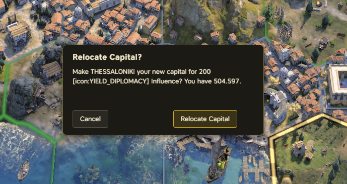

# Change Capital — relocate your capital, freely or for a price

A small gameplay mod, not a civilization. Two ways to move your capital:

1. **Free reselection at every age transition.** The stock "pick your new capital" step no longer
   restricts candidates to settlements connected to the old capital by a land trade route - every
   owned settlement is offered.
2. **Relocate any time, for a price.** A "Make Capital" project appears in the production/purchase
   screen of any of your other cities. Confirming spends Diplomacy (Influence) points and makes
   that city your capital immediately. Cost scales with the current age: 100 in Antiquity, 200 in
   Exploration, 300 in Modern.

**Replaces no game files, so it does not fight other mods.** The "Make Capital" row is added
through `Controls.decorate("panel-production-chooser", ...)`, the engine's own component
decorator API. The engine keeps a *list* of decorator providers per component
(`core/ui/component-support.js`, `addDecorator`), so every mod that decorates the same panel gets
its decorator constructed — they stack rather than clobber. The confirmation is the game's own
dialog (`DialogBoxManager.createDialog_ConfirmCancel`, reached by dynamic `import()` of the stock
module), so it inherits the game's styling, input routing, controller navigation and
Escape-to-close instead of reimplementing them.

An earlier version did this by shipping a modified copy of
`base-standard/ui/production-chooser/production-chooser-helpers.js` at the stock file's own path.
That works — it is what the Workshop mod *Move Building* does — but a file path is
winner-takes-all: whichever mod loads last wins outright and the other's whole file silently
stops running. That version is in the history, in the commit that first added this mod.

Design notes, the exact native APIs this relies on, and the open verification items:
[`plans/change-capital.md`](../plans/change-capital.md). The general technique - the game's three
additive UI extension points (`Controls.decorate`, the seven `ModdingRegistry` mod slots, and
dynamic `import()` for things like the native dialog manager), and why overwriting a stock file
is a last resort - is written up as a standalone, reusable skill:
[`skills/civ7-ui-extension/`](../skills/civ7-ui-extension/).

Installing, game versions and releasing are shared by every mod in this repository and described in the [main README](../README.md).
